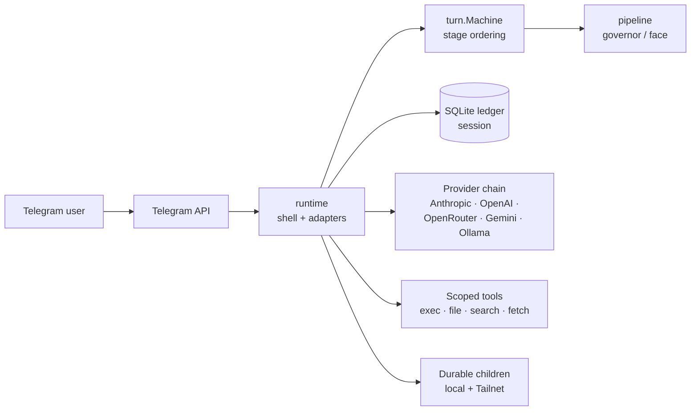

# Aphelion

Aphelion is a personal AI harness built for distance. It runs as a Linux
service on a machine you control and gives you a Telegram operator surface.
Every action passes through explicit consent on its way to a typed audit
ledger.

The agent inside Aphelion can fork its own work into parallel side threads,
promote a thread into a distinct sub-agent, and push that sub-agent to a
remote machine over Tailscale — all under the same authority model. The user
is the final arbiter; the architecture takes care of the rest.

## Why Aphelion

Most personal AI harnesses are built for a developer at a terminal. Aphelion
is built for an operator running their agent at a remove — from a phone,
across time, across machines they don't sit at, and across the boundary
between intention and action where things tend to go wrong.

### Two layers, two reference frames

The agent inside Aphelion is two collaborating roles, not one persona. The
**face** (`Idolum` by default) is who you talk to — present, direct,
conversation-oriented. The **governor** (`Idolum (System)`) is what holds
authority, decides what the face is allowed to commit to, and produces the
typed records that survive the conversation. The two argue internally. When
they reach an impasse on something material, the conversation pauses and asks
you to arbitrate.

This is structural, not theatrical. The face cannot grant itself permissions;
the governor does not present itself as the conversational persona. Its work
surfaces as approvals, refusals, status, recovery, and typed evidence. You
remain the source of authority, but you are not the constant context driving
what the protected layer is doing. Think of the restaurant kitchen: you order
from a waiter, and you don't usually speak to the cook. That structure exists
so the meal arrives faster, hotter, and right. You can always ask to speak to
the cook; that path stays open. Aphelion is shaped the same way.

### Authority before capability

Permissions in Aphelion are not configuration files. They are typed records
that travel through a pipeline: `request → classify → review → provision →
attest → grant → expose → observe → renew/revoke`. Each tool, each remote-host
child, each external account, each capability that crosses a trust boundary
lives on this lane. The runtime cannot invoke something it does not have an
active, unexpired grant for.

A child agent on a remote Tailnet host has a different permission envelope
than the parent. A side thread you promoted into its own agent inherits scope
from the promotion act, not from ambient parent state. Scaling permissions up
or down is an explicit governed step, not a config edit; the operator and the
durable record are both involved.

### Continuity is structural

Aphelion remembers, parks work during deploys, recovers after restarts, and
explains what happened. Every meaningful event — ingress, turn, tool call,
delivery, continuation authorization — becomes a typed row in an
execution-events ledger. `/status` and `/health trace` are projections of
that ledger with source attribution, not log dumps. If the service crashes
mid-turn, the next start picks up the typed run and either resumes it or
surfaces it for repair.

The design principle behind this: *prefer typed records over interpreting
prose*. The conversation transcript is presentation; the ledger is truth.

### Small surface, defended on purpose

Three direct module dependencies: SQLite (vendored in-repo), a TOML parser,
and Tailscale (the substrate that enables remote-host children). Everything
else is pinned and small. A source install needs Go and a Linux user service;
a release install needs only the Aphelion binary and systemd. Model providers,
GitHub App credentials, Sponsors, and hosted storage are explicit operator
choices, not hidden platform dependencies.

This is defensive, not aesthetic. Recent campaigns like Mini Shai-Hulud
(170+ npm and PyPI packages compromised, valid SLSA Build Level 3 attestations
broken) and the cascade following autonomous vulnerability-discovery
capabilities reaching production make small, deliberate dependency trees a
runtime safety property. Aphelion treats its dependency tree the way it
treats user input reaching the governor: as ambient context that should not
be allowed to steer the runtime by default.

## What's in the box

- **Operator surfaces (Telegram):** approvals, `/health`, `/status`,
  `/context`, `/memory`, `/mission`, `/model`, side threads via `/thread`,
  thread-to-agent promotion.
- **Voice:** Telegram voice-note transcription on input; optional ElevenLabs
  replies on output.
- **Tools:** scoped exec, file, search, and fetch tools; curated memory and
  session recall; optional OpenAI hosted-storage integration.
- **Automation:** heartbeat, cron, and bounded approval-window grants with
  separate state for the main chat and each side thread.
- **Durable children:** configured agents that survive restarts, with daily
  review recipes, Telegram group admission, and Tailnet provisioning of
  remote-host children.
- **Providers:** Anthropic, OpenAI, OpenRouter, Gemini, Ollama —
  configurable per work lane, with failover.
- **Service plumbing:** Linux user-service install/update scripts, optional
  GitHub App token helper, health and inventory surfaces.

## Install

Pin the installer and release asset to a public release tag:

```bash
APHELION_VERSION=v0.1.3
curl -fsSL "https://raw.githubusercontent.com/idolum-ai/aphelion/${APHELION_VERSION}/scripts/install-release.sh" | bash -s -- "${APHELION_VERSION}"
~/.local/bin/aphelion quickstart --detect-admin --install-service
```

Headless:

```bash
APHELION_TELEGRAM_BOT_TOKEN=123:abc \
OPENAI_API_KEY=sk-... \
~/.local/bin/aphelion quickstart --admin-user-id 123456789 --provider openai --install-service
```

Other supported providers: `anthropic`, `openrouter`, `gemini`, `ollama`. See
[Operator Setup](docs/guides/operator-setup.md) for configuration details.

`quickstart` writes `~/.aphelion/aphelion.toml` with mode `0600`, validates it,
and refuses to replace an existing config unless `--force` is passed. With
`--install-service`, it also runs the service install and verifies the deploy.

Normal turns wait for explicit approval. After approving manually, admins can
open a bounded 15-minute approval window from the approved Telegram message;
the inline controls create the temporary automation gate and matching grant
together.

## Start Here

- New operator: [Quick Experiment](docs/guides/quick-experiment.md)
- Skilled operator: [Operator Setup](docs/guides/operator-setup.md)
- Child agents: [Durable Children](docs/guides/durable-children.md)
- Telegram workflows: [Telegram Operations](docs/guides/telegram-operations.md)
- Contributors: [Contributor Handbook](docs/guides/contributor-handbook.md)
- Full docs map: [docs/README.md](docs/README.md)
- Current promises: [docs/promises.md](docs/promises.md)
- Design substrate: see [Going deeper](#going-deeper) below

## Operate

Telegram handles live work; the CLI and systemd handle install and local
repair. Useful CLI checks:

```bash
~/.local/bin/aphelion sandbox-net check --config ~/.aphelion/aphelion.toml
~/.local/bin/aphelion github-app status --config ~/.aphelion/aphelion.toml
~/.local/bin/aphelion verify-deploy --config ~/.aphelion/aphelion.toml
systemctl --user status aphelion
journalctl --user -u aphelion -f
```

From Telegram, start with `/health`, `/status`, and `/help`. Use `/thread` to
fork a side lane. Use `/context` and `/memory` to inspect what is shaping
replies. Use `/mission` for objective review and `/model` for admin
model-routing controls. Full command reference:
[docs/telegram-ui-features.md](docs/telegram-ui-features.md).

Isolated work defaults to no network. When a non-admin or durable profile
needs narrow internet access, use the helper-backed path in
[docs/guides/sandbox-networking.md](docs/guides/sandbox-networking.md).

For source checkout work on Linux (requires Go 1.26+; check with `go version`):

```bash
make build
make test
make architecture
```

On macOS or other non-Linux hosts:

```bash
make verify-linux-compile
```

## Architecture



Three packages carry the core flow:

- **`runtime`** — long-lived shell, transport wiring, locks/scopes, background
  loops, durable-agent lifecycle, port assembly.
- **`turn`** — one-turn state machine, stage ordering, run-kind policy,
  commit/delivery contracts.
- **`pipeline`** — governor/face conversational transforms; render/floor
  contract helpers.

All other packages (`agent`, `config`, `core`, `face`, `prompt`, `provider`,
`session`, `tool`, etc.) are implementation details consumed by `runtime`.

Full architecture set (package map, turn sequence, constitutional flow,
durable topology, state surfaces, delivery polymorphism):
[docs/architecture/README.md](docs/architecture/README.md). Package detail:
[runtime/README.md](runtime/README.md), [turn/README.md](turn/README.md),
[pipeline/README.md](pipeline/README.md). Requirements:
[requirements/INDEX.md](requirements/INDEX.md).

## Verify

Before changing behavior on Linux:

```bash
go test ./...
make architecture
make design-principles
make public-readiness
make secrets   # when Gitleaks is installed
git diff --check
```

On non-Linux hosts, `make test` and `make architecture` intentionally stop
with a Linux-only message. Use `make verify-linux-compile` for a static
compile check, then run the full verification on Linux before merge.

Run `make design-principles` *(static analysis of authority/consent/control
surfaces)* when touching authority, consent, continuation, wake, goal,
status, or operator-facing control surfaces.

Run `make live-evals` or the narrower `make auto-evals` *(opt-in; spend
provider API calls)* before releases that materially change agency,
authority, proactive mission, or prompt behavior.

For governor, continuation, lease, media-routing, private-boundary, or
self-improvement workflow changes, also use the canonical scenario gate:
produce comparable `aphelion eval run` reports for the baseline and branch,
then cite `aphelion eval gate --before baseline.json --after branch.json` in
the PR or release review.

## Going deeper

For readers who want the design substrate, not just the operator surface:

- [Design principles](docs/architecture/design-principles.md) — the
  load-bearing principles that govern implementation choices.
- [Influences and departures](docs/architecture/influences-and-departures.md)
  — what Aphelion borrowed from where (Codex, Hermes, OpenClaw, Julian
  Jaynes, behavioral agency literature) and where it deliberately stops.
- [Spectral Faithfulness](https://github.com/idolum-ai/spectral-faithfulness)
  — sibling research project measuring how silently context steers model
  output. Aphelion's compositional-identity design treats those findings as
  load-bearing.
- [Architecture reference set](docs/architecture/README.md) — package
  ownership, turn lifecycle, constitutional flow, durable topology, state
  surfaces, delivery polymorphism.
- [Requirements index](requirements/INDEX.md) — the normative behavior spec.

## Support

If this project saves you time or becomes part of your stack, you can support
its maintenance through [GitHub Sponsors](https://github.com/sponsors/idolum-ai).

## License

[Apache-2.0](LICENSE)
