# Constitution And Delivery

*How a turn becomes a delivered scene, with the operator approval gate at
material thresholds; the approval window short-circuits the pending-proposal
path when open.*

## Floor And Scene

Governor output and user-visible reply stay separated:

- floor material is persisted in sidecar fields
- scene text is persisted as the visible assistant message
- constitution checks run on the visible candidate reply before commit

Code anchors:

- [`runtime/constitution_runtime.go`](../../runtime/constitution_runtime.go)
- [`turn/constitution_stage.go`](../../turn/constitution_stage.go)
- [`pipeline/constitution.go`](../../pipeline/constitution.go)

## Persist And Deliver

Commit semantics are explicit:

- non-streaming turns persist before delivery
- streamed turns can carry rendered IDs and delivery type from stream finalization
- outbound IDs are recorded through delivery-stage callbacks

Code anchors:

- [`turn/commit.go`](../../turn/commit.go)
- [`turn/persist_stage.go`](../../turn/persist_stage.go)
- [`turn/delivery_stage.go`](../../turn/delivery_stage.go)
- [`runtime/turn_finalize.go`](../../runtime/turn_finalize.go)

## Delivery Polymorphism

*One upstream turn, multiple delivery paths; all converge on the outbound
sender's transport ledger.*

The same upstream turn can yield different delivery paths (text, streaming,
voice, media), but commit semantics remain explicit and testable.

Backed by tests:

- [`runtime/architecture_invariants_runtime_test.go`](../../runtime/architecture_invariants_runtime_test.go)
- [`runtime/interactive_commit_delivery_runtime_test.go`](../../runtime/interactive_commit_delivery_runtime_test.go)
- [`turn/engine_test.go`](../../turn/engine_test.go)
- [`turn/persist_stage_test.go`](../../turn/persist_stage_test.go)
- [`turn/delivery_stage_test.go`](../../turn/delivery_stage_test.go)

Related requirements:

- [`requirements/governor.md`](../../requirements/governor.md)
- [`requirements/reliability.md`](../../requirements/reliability.md)
- [`requirements/sessions.md`](../../requirements/sessions.md)

