# Durable Children

Durable children are bounded child Aphelions. Some may be user-facing personas,
but they remain subordinate to parent governance and policy boundaries.

## Live Shape

- Parent runtime owns durable-agent registry and wake loops.
- Durable child creation supports progressive modes: `sketch` for a parent-side idea/prototype record, `local` for local workspace and memory without an external adapter, `external` for read-only adapter-backed observation, and `live` for channel-facing operation within policy.
- Child execution stays scoped by charter, tool scope, and live policy.
- Upward communication is through bounded review artifacts and summaries.
- Telegram relay turns can target a child inline from DM using `agent:<agent_id> ...` and execute in child scope.
- Child wakes can be transport-triggered (`telegram_update`) or scheduler-triggered (`poll`, `push`, `poll_or_push`) depending on the child role.
- Child wake ingress is selected through pluggable runtime adapters; each adapter contributes wake payload synthesis and review finalization semantics.
- External-channel children use a generic runtime state slot (`external_channel`) for adapter name, cursor/session reference, last command, attempt/success timestamps, artifact pointer, status/error, failure count, backoff, and opaque adapter state. Protocol-specific residue belongs under `adapter_state`, not as a new parent-core continuity field per child or transport.
- The default install recipe can create one example scheduled child (`idolum-daily-review`) using the same durable wake substrate: it stages yesterday's transcript into child-local files and starts a plain scheduled check-in chat upward. The runtime does not recreate this child if the target install removes or disables it; the install owns whether the recipe is present. A read-only Codex app-server external-channel adapter is also available for remote child status heartbeats through the same wake substrate.
- All wake-driven durable work runs through one child-turn substrate (prompt context + governor/face loop + principal-scoped tools), either in-process or isolated (`durable-agent child-run --agent ...`) when bootstrap/isolation is configured.
- Durable wake polling fans out through a small bounded worker pool. Each child
  wake gets its own deadline, so a blocked remote or isolated child records its
  own failure without starving unrelated children.
- Tailnet-provisioned children are installed through `durable-agent provision`: the parent sends the current Aphelion binary and remote bootstrap over Tailscale SSH, the child runs its own user service, and the child polls the parent Tailnet `/control` plane for enrollment, policy snapshots, parent conversation, review artifact upload, and acknowledgement. The parent binds control-plane authority to the Tailnet stable node identity observed by tsnet, either when accepting enrollment or on the first valid accepted control request for an active enrollment with no stored node identity, and rechecks declared child hostname/tags on each peer-identified control request.
- Durable lifecycle and policy events are mirrored into TES (`durable.wake.*`, `durable.state.*`, `durable.policy.*`, `durable.parent.acknowledged`) and used to project admin-facing health and latest-apply visibility.
- Operational child/runtime failures are surfaced to admin chat through deduplicated operational alerts.

Code anchors:

- [`durableagent/runtime.go`](../../durableagent/runtime.go)
- [`runtime/durable_group.go`](../../runtime/durable_group.go)
- [`runtime/durable_wake.go`](../../runtime/durable_wake.go)
- [`runtime/durable_wake_loop.go`](../../runtime/durable_wake_loop.go)
- [`runtime/durable_wake_child.go`](../../runtime/durable_wake_child.go)
- [`runtime/durable_wake_turn.go`](../../runtime/durable_wake_turn.go)
- [`runtime/durable_child.go`](../../runtime/durable_child.go)
- [`main_durable_child.go`](../../main_durable_child.go)

## Boundaries

- Child credentials and local storage roots are child-scoped.
- Child work does not directly mutate parent prompt/memory surfaces.
- Durable child runtime reuses `turn` orchestration where lifecycle aligns.
- Child bootstraps must not carry parent Telegram polling credentials or parent principal IDs.
- Parent-child coordination uses bounded runtime channels: local bootstrap/stdout for isolated in-process execution, child-local inbox files for channel-delivered messages, and parent Tailnet `/control` for child-poll enrollment, policy, parent conversation, review artifacts, and acknowledgement. The parent does not require inbound HTTP on the child, and Tailnet reachability is paired with stored node identity and current hostname/tag posture through accepted signed control envelopes before the child can continue exercising the control plane.
- Parent Aphelion must not accumulate child feature workarounds such as channel-, browser-, or site-specific readiness logic. Channel-specific probes and repairs belong in the child runtime environment or in pluggable adapters proposed through governance.
- Adapter operations are governed commands, not ambient prompt authority. Parent runtime may schedule or manually trigger a command such as a read-only status heartbeat only when the durable child policy and grants allow it; prompts are payloads inside those commands and do not widen authority.
- Durable children ask upward through parent conversation, review artifacts, and capability/delegation proposals when they need system changes. The parent can grant or materialize generic capabilities, but should not become specialized application code for one child.
- Parent-conversation acknowledgements are message-ID explicit, and continuity
  updates are written transactionally so parent guidance, child review state, and
  wake bookkeeping do not overwrite each other under concurrent control-plane
  traffic.

Related requirements:

- [`requirements/durable-agents.md`](../../requirements/durable-agents.md)
- [`requirements/security.md`](../../requirements/security.md)
- [`requirements/operations.md`](../../requirements/operations.md)
- [`docs/architecture/transparent-execution-sequence.md`](./transparent-execution-sequence.md)
