# Package Ownership

*Package layout grouped by role; runtime is the central shell consuming
storage, transport, providers, capabilities, and shared domain packages.*

## Root Package

The root package is the single-binary composition surface.

- Owns CLI command dispatch, install/deploy entrypoints, and process startup.
- Owns Telegram UI glue that adapts transport callbacks into runtime or decision
  APIs. Review-event Telegram decision callbacks are delegated to
  `internal/telegramdecision`; root only assembles the transport/control
  dependencies and dispatches into that boundary.
- May import `runtime` and assemble concrete dependencies.
- Should avoid owning durable domain behavior once a stable lower-level owner
  exists.

Code anchors:

- [`main.go`](../../main.go)
- [`commands.go`](../../commands.go)
- [`maintenance.go`](../../maintenance.go)
- [`internal/telegramdecision`](../../internal/telegramdecision) for review-event Telegram decision callback behavior.

## Runtime

`runtime` is the house shell.

- Owns transport ingress/egress, principal/scope/session wiring, and long-lived loops.
- Owns pre-turn shell handoff into species assemblers.
- Owns two execution-family assembly spines: interactive-like (`interactive_like_assembly.go`) and maintenance (`maintenance_turn_assembly.go`).
- Adapts concrete ports into `turn.Machine`.
- Does not own one-turn stage ordering.

Code anchors:

- [`runtime/runtime.go`](../../runtime/runtime.go)
- [`runtime/turn.go`](../../runtime/turn.go)
- [`runtime/interactive_dm_turn.go`](../../runtime/interactive_dm_turn.go)
- [`runtime/interactive_like_assembly.go`](../../runtime/interactive_like_assembly.go)
- [`runtime/maintenance_turn_assembly.go`](../../runtime/maintenance_turn_assembly.go)
- [`runtime/maintenance_turn.go`](../../runtime/maintenance_turn.go)
- [`runtime/durable_group.go`](../../runtime/durable_group.go)
- [`runtime/codex`](../../runtime/codex) for Codex app-server leaf helpers consumed only by the runtime shell.
- [`runtime/doctor`](../../runtime/doctor) for the doctor report assembly (the operator-visible Telegram command is `/health`; this package's name reflects the report's heritage as the doctor projection), evidence sections, Telegram condensation helpers, and maintainer artifact formatting consumed only by the runtime shell.
- [`runtime/mission`](../../runtime/mission) for Mission Ledger command rendering, Mission Question prompt/classifier mechanics, and mission proposal formatting consumed only by the runtime shell.

Runtime leaf subpackages may be imported by top-level `runtime` for bounded helper mechanics. They must not become new owners for ingress/session/lifecycle wiring or broad runtime policy. The architecture import guard forbids non-root packages from importing `runtime` internals, which keeps these leaves private to the runtime shell rather than turning them into cross-repository domain APIs. `ARCHITECTURE_WAIVERS.md` records any time-boxed runtime leaf seams that have been approved before extraction, including the `runtime/continuation/` continuation seam.

## Turn

`turn` is the one-turn state machine.

- Owns policy by run-kind.
- Owns stage order and commit/delivery orchestration contracts.
- Consumes governor/face/persistence/delivery ports supplied by runtime.

Code anchors:

- [`turn/engine.go`](../../turn/engine.go)
- [`turn/stages.go`](../../turn/stages.go)
- [`turn/policy.go`](../../turn/policy.go)
- [`turn/ports.go`](../../turn/ports.go)

## Pipeline

`pipeline` owns governor/face conversational transforms.

- Brokerage parsing and ratification shaping.
- Floor material extraction and fallback serialization.
- Visible-reply constitution validation and repair contract shaping.
- Render-decision policy helpers.

Code anchors:

- [`pipeline/contracts.go`](../../pipeline/contracts.go)
- [`pipeline/brokerage.go`](../../pipeline/brokerage.go)
- [`pipeline/material.go`](../../pipeline/material.go)
- [`pipeline/fallback.go`](../../pipeline/fallback.go)
- [`pipeline/constitution.go`](../../pipeline/constitution.go)

## Config

`config` owns the operator configuration contract.

- Owns defaults, TOML loading, ignored-key warnings, normalization, and
  validation for live knobs.
- Keeps validation split by durable config concept: Telegram, governor,
  runtime-state, provider/work selection, operator controls, integrations, and
  sandbox ceilings.
- Should not own runtime assembly, provider clients, or migration behavior.

Code anchors:

- [`config/config.go`](../../config/config.go)
- [`config/load.go`](../../config/load.go)
- [`config/validate.go`](../../config/validate.go)
- [`config/validate_governor.go`](../../config/validate_governor.go)
- [`config/validate_provider_work.go`](../../config/validate_provider_work.go)

## Boundary Guards

- [`architecture_import_guard_test.go`](../../architecture_import_guard_test.go) enforces stable import boundaries between composition, runtime, turn, pipeline, transport, storage, and tool packages.
- [`runtime/architecture_invariants_runtime_test.go`](../../runtime/architecture_invariants_runtime_test.go) pins floor/scene and persist-before-deliver behavior.
- [`runtime/interactive_like_assembly_test.go`](../../runtime/interactive_like_assembly_test.go) defends shared interactive-like assembly behavior across DM and durable-group species.
- [`runtime/maintenance_assembly_boundary_runtime_test.go`](../../runtime/maintenance_assembly_boundary_runtime_test.go) defends maintenance-family assembly boundary behavior across heartbeat, cron, and startup recovery species.

## Storage, Transport, and Tools

- `session` owns durable storage records and persistence APIs. It should not
  import orchestration packages.
- `telegram` owns Telegram wire/client behavior. It should not import runtime,
  turn, or pipeline orchestration.
- `tool` owns bounded tool implementations and sandbox integration. It should
  not import runtime, turn, or pipeline orchestration.
- `durableagent` owns child-agent substrate, enrollment, policy transport,
  remote child sync, snapshots, provisioning, and forensics. It may depend on
  storage contracts, but not on runtime orchestration; higher layers still decide
  policy semantics, authority grants, deployment, and operator review. See
  [`durableagent-product-contract.md`](./durableagent-product-contract.md).

## Membranes worth keeping explicit

These packages are intentionally small because their power comes from what they
refuse to own. Their boundaries are enforced by `architecture_import_guard_test.go`.

### `media`: provider-neutral media substrate

- Owns provider-neutral media contracts, currently transcription and document
  text extraction requests/responses.
- May define local extraction adapters when they stay provider-neutral and do
  not decide retention, prompt injection, or transport UX.
- Must not own Telegram attachment flow, provider-specific media encoding,
  session retention policy, tool authority, or runtime turn orchestration.
- The invariant is: media extraction is an input transformation, not permission
  to retain content or inject it invisibly into future turns.

### `githubapp`: GitHub credential membrane

- Owns GitHub App private-key parsing, JWT signing, installation-token minting,
  repository/permission narrowing, Git credential host rendering, and token
  redaction.
- Must not own PR creation, git workflow decisions, GitHub action authority,
  tool invocation, session state, runtime orchestration, or Telegram UI.
- The invariant is: credential availability is not authority. A token minted by
  this package is only material; a higher approved grant/lease decides whether it
  may be used.

### `governorauth`: governor auth material membrane

- Owns resolving, loading, validating, and saving governor backend auth material
  from configured Aphelion or Codex CLI sources.
- Must not own backend transport, streaming, retry policy, turn orchestration,
  tool authority, session state, or Telegram UI.
- The invariant is: auth source discovery is not backend behavior. It returns a
  typed bundle; `runtime` chooses the active route and `governorbackend` speaks
  the backend protocol.

### `governorbackend`: provider-shaped governor backend adapter

- Owns Codex/ChatGPT-style backend request translation, streaming event
  normalization, continuation handling, auth refresh transport, error
  classification, and partial-output accumulation.
- Must not own auth discovery, prompt policy, authority gates, tool execution,
  session state, runtime orchestration, or Telegram UI.
- The invariant is: backend transport is not judgment. It adapts a backend into
  Aphelion's provider interface so the governor can run through it without
  leaking backend-specific protocol into core authority semantics.

### `durableagent`: child continuation substrate

- Owns child-agent persistence, enrollment, signatures, snapshots, profiles,
  remote-loop plumbing, conversation relay, and review artifact movement.
- Must not own tool authority, parent session state, runtime orchestration, or
  Telegram command/UI behavior.
- The invariant is: continuation is not permission. Child reports, enrollment,
  wakeups, and durable state are evidence until higher governance grants
  authority.

- `githubapp` owns GitHub App key parsing, JWT signing, and installation-token
  exchange. It does not decide runtime authority or inject credentials into
  tools.

Related requirements:

- [`requirements/core.md`](../../requirements/core.md)
- [`requirements/governor.md`](../../requirements/governor.md)
- [`turn-lifecycle.md`](turn-lifecycle.md)
