# State Surfaces

*Session state is split across canonical surfaces, operational
current-state stores, and operator projections; file-backed memory lives
alongside the SQLite ledger.*

Aphelion state is intentionally multi-surface.

## Surfaces

- Visible transcript ledger in `session` (`user`/`assistant` scene text):
  canonical.
- Floor sidecars and floor metadata attached per turn: canonical when recorded
  on messages; `sessions.last_floor_*` is the operational current-state store.
- Plan state and operation state sidecars: operational current-state stores.
- Review events and outbound delivery records: pending review events are
  operational current-state stores; delivered review events and outbound records
  are canonical delivery evidence.
- Turn-run recovery and accounting records for startup repair and live
  diagnosis: operational current-state store.
- Execution event timeline (`execution_events`) for ingress/turn/tool/delivery
  truth: canonical.
- Universal evidence ledger (`evidence_objects`, `evidence_links`, and
  `evidence_hydration_runs`) for immutable source snapshots and audited context
  hydration: canonical for evidence-object identity, source provenance, payload
  hash, and hydration history.
- Judgment ledgers (`judgments`, `judgment_uses`, and
  `judgment_challenge_events`) for durable interpretations, consequential
  commitment traces, and append-only challenge/adjudication events: canonical
  for which interpretation was produced, which consumer used it, and which
  later events challenged or reconciled it.
- Telegram ingress offset, accepted-update, and poison-update ledgers:
  operational current-state stores for transport recovery.
- Telegram work-surface registry in code for startup replay of primary messages,
  callback work, and decision-resume work: compiled contract.
- Telegram side-thread registry (`telegram_threads`) for per-chat work lanes:
  operational current-state store.
- Typed Telegram decision-resume rows (`pending_busy_decisions` and
  `pending_artifact_retention`) for prompts whose original turn may have been
  interrupted before callback resolution: operational current-state stores.

Code anchors:

- [`session/store.go`](../../session/store.go)
- [`runtime/turn_finalize.go`](../../runtime/turn_finalize.go)
- [`runtime/awareness.go`](../../runtime/awareness.go)
- [`turn/awareness.go`](../../turn/awareness.go)
- [`docs/architecture/transparent-execution-sequence.md`](./transparent-execution-sequence.md)

## Classification Matrix

Classifications below use the shared truth classes defined in
[`docs/architecture/README.md`](./README.md).

| Surface / Store | Classification | Canonical Question |
| --- | --- | --- |
| `session.execution_events` | canonical | What happened in runtime, in what order? |
| `session.execution_run_authority` | canonical | Which durable turn run was admitted under which principal, session, execution species, and single causal lease? |
| `session.evidence_objects` | canonical | Which immutable source evidence snapshots are available for rehydration, and what source/status/hash do they carry? |
| `session.evidence_links` | canonical | Which evidence objects were explicitly linked, by what relation and source? |
| `session.evidence_hydration_runs` | canonical | Which evidence objects were selected or reported missing for a hydration request? |
| `session.judgments` | canonical | Which durable interpretation did a local surface produce, with which inputs, dependencies, completeness, and content hash? |
| `session.judgment_uses` | canonical | Which judgment refs were used, by which consumer and policy, to commit an auditable consequence? |
| `session.judgment_challenge_events` | canonical | Which append-only events challenged, adjudicated, or reconciled a durable judgment? |
| `session.messages` | canonical | What scene text was recorded for the session? |
| `messages.floor_content` | canonical | What floor text was captured alongside scene text at message-record time? |
| `messages.floor_metadata` | canonical | What floor metadata/artifact references were captured alongside scene text at message-record time? |
| `session.outbound_messages` | canonical | Which outbound deliveries were recorded at the transport ledger level (not guaranteed human render)? |
| `session.review_events (status='delivered')` | canonical | Which bounded review artifacts were shown to humans? |
| Parent/child memory files and `rhizome_*` tables | canonical | What durable meaning has been retained over time? |
| `session.durable_agents` | canonical | What durable-child identity/config is currently declared? |
| `session.durable_agent_state (identity/config-bearing fields)` | canonical | Which child identity/config handshake facts are currently declared? |
| `session.durable_agent_state (runtime/apply/transient posture fields)` | operational current-state store | What durable-child runtime/apply status is currently declared? |
| `sessions.last_floor_text` | operational current-state store | What floor text is currently declared for the active session? |
| `sessions.last_floor_metadata` | operational current-state store | What floor metadata is currently declared for the active session? |
| `sessions.plan_state_json` | operational current-state store | What plan intent is currently declared? |
| `sessions.operation_state_json` | operational current-state store | What operation intent/stage is currently declared? |
| `pending_decisions` | operational current-state store | What decisions are currently pending and actionable? |
| `pending_busy_decisions` / `pending_artifact_retention` | operational current-state store | Which Telegram decision prompts have typed work that can be resumed after restart? |
| `telegram_ingress_offsets` | operational current-state store | Which Telegram update offset is safe to request next? |
| `telegram_ingress_updates` | operational current-state store | Which Telegram updates are accepted, queued, running, or terminal for transport recovery? |
| Telegram startup work-surface registry | compiled contract | Which typed Telegram ingress surfaces are eligible for startup replay? |
| `telegram_ingress_failures` | canonical | Which Telegram updates failed normalization or handling? |
| `telegram_threads` | operational current-state store | Which per-chat side threads are open or absorbed, and what outcome note closed them? |
| `sessions.continuation_state_json` | operational current-state store | What continuation state, embedded `ActionProposal`, and embedded `ContinuationLease` are currently declared? |
| `mission_ledger` candidate rows projected as pending items | projection | Which durable candidate missions should be visible for operator review now? |
| `session.review_events (status='pending')` | operational current-state store | Which review artifacts are queued for governance delivery? |
| `/status` | projection | How should system/chat state be rendered for operators now? |
| `/health trace` | projection | How should execution evidence be rendered for diagnosis now? |
| `provider_health` in `/health` | projection | Is recent inference-provider pressure the current explanation for slow, failed, or retried work? |
| Quick-read and progress render blocks | projection | What compact operator narration should be surfaced now? |
| `turn_runs` | operational current-state store | What startup recovery/run bookkeeping and accounting hints are available for interrupted or active work? |
| `curiosity_leases` | operational current-state store | What config-backed read-only curiosity allowance is active, expired, or exhausted for the current period? |
| `curiosity_observations` | canonical | What silent read-only observations were actually recorded from candidate-bound curiosity looks? |

## Removed Surface Rule

Historical rows and aliases that are no longer part of the current truth model
must be deleted or rejected. They must not become operator projection inputs.
- When `/status` or `/health trace` uses fallback rows, that usage should be surfaced
  as source attribution.

ActionProposal / ContinuationLease note:

- In v1 these records are embedded in `sessions.continuation_state_json` so the existing continuation button flow remains the operational current-state surface.
- TES `continuation.*` events remain canonical for what was offered, approved, consumed, revoked, or blocked at runtime.

Turn-run accounting note:

- `turn_runs` now also stores operational counters such as turn index, tool input
  characters, assistant output characters, provider input/output tokens, and
  provider cache read/write tokens.
- Those counters support `/status`, `/health trace`, and doctor diagnosis. They
  do not replace TES as execution-order truth and should not be treated as a
  canonical transcript.

Universal evidence ledger note:

- `evidence_objects` are immutable snapshots keyed by source kind and source ref.
  Mutable operational stores may produce multiple evidence snapshots over time;
  the evidence object itself is not updated after insertion.
- `evidence_hydration_runs` records deterministic evidence selection for a
  current session or operation, including missing required evidence IDs and
  fallback use.
- Hydration preserves the active session boundary by default. A known evidence
  ID from another session is a gap, not ambient recall.
- Startup migration seeds only current session snapshots. Explicit historical
  backfill can record the current value of mutable JSON stores, but it must not
  pretend intermediate states were recovered.

Judgment ledger note:

- `judgments` records selected local interpretations; `judgment_uses` records
  the consequence committed by a consumer; `judgment_challenge_events` records
  append-only dissent/adjudication facts. Together they are not a universal
  belief engine; they are an audit and reconciliation substrate over existing
  evidence, effect-attempt, hydration, and presentation records.
- The implemented slices cover shell/Codex execution uses, evidence hydration
  model-context admission, re-entry presentation, and brokerage control-flow
  selection. Domain-specific challenge adapters and consequence-specific
  reconciliation workers remain incremental work.

Curiosity note:

- `curiosity_leases` are operational allowance records, not operator approval
  leases and not capability grants.
- `curiosity_leases.status` describes only the current allowance envelope
  (`active`, `expired`, or `exhausted`). It is not a per-look success or
  completion state.
- Curiosity daily spend is scoped to the lane/day. Config allowlist changes may
  update the active lease envelope, but they do not create fresh same-day spend.
- `curiosity_observations` are typed facts produced by read-only candidate-bound
  looks. They may feed interior signal pressure, but they do not directly write
  curated memory, assert completion, or create authority.
- Curiosity pressure handoff is reconciled by the runtime-owned pressure
  fingerprint. An observation without a matching `interior_signal_observations`
  row from source `curiosity` is stranded and should surface in diagnostics
  instead of being treated as applied pressure. Current behavior is detection,
  not automatic replay: a future repair actor may re-apply stranded pressure
  idempotently, but ordinary diagnostics must not hide the gap.
- URL curiosity source refs are durable identities, not fetch targets. Durable
  source/evidence refs use a canonical host/path/query-key identity plus a hash;
  raw URL query values stay in config or the selected tool input only.
- Whether the latest curiosity look succeeded, failed, or produced useful
  evidence must be derived from `curiosity_observations` plus execution events,
  not inferred from the lease status.

Staged identity decision:

- `session.durable_agents` is canonical for durable child identity/config.
- `session.durable_agent_state` is split by meaning:
  - identity/config-bearing fields are canonical identity/config.
  - runtime/apply/transient posture fields remain operational current-state.

## Why This Matters

- Keeps user-visible continuity and machine-audit continuity separate.
- Preserves floor/scene split without losing recovery/review semantics.
- Prevents architecture drift into one hidden “memory blob.”
- Makes `/status`, `/health trace`, and progress narration converge on one shared execution timeline instead of independent ad-hoc state machines.
- Keeps transport poison messages explicit: a skipped Telegram update is a
  ledgered fact with update ID, surface, refs, and error text, not an invisible
  in-memory offset jump.
- Keeps offset advancement tied to accepted outcomes: a Telegram update past the
  saved offset is either terminally recorded or recoverably queued for replay.
- Keeps replay explicit: primary messages, callback work, and decision-resume
  work are declared as typed startup work surfaces instead of rediscovered from
  command text.
- Keeps redelivery idempotent: a terminal Telegram ingress row is not dispatched
  again, and accepted work is dispatched only while its ledger status remains
  accepted or queued.

Related requirements:

- [`requirements/sessions.md`](../../requirements/sessions.md)
- [`requirements/operations.md`](../../requirements/operations.md)
- [`requirements/hidden-inputs.md`](../../requirements/hidden-inputs.md)
- [`requirements/reliability.md`](../../requirements/reliability.md)
