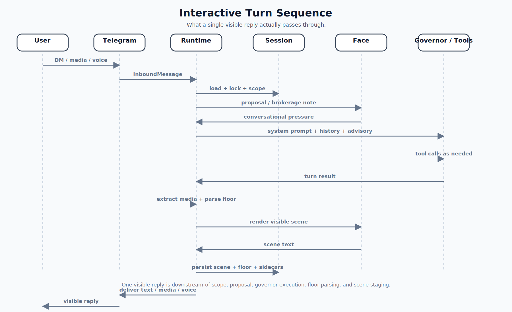

# Turn Lifecycle

## Interactive DM

Current interactive turn order:

1. Runtime shell resolves principal/scope, starts chat actions, and holds session lock.
2. Runtime interactive-DM assembler builds one-turn coordinator/ports from shared interactive-like assembly.
3. `turn.Machine` runs proposal/governor/face stages according to policy.
4. `turn` persists transcript + sidecars.
5. `turn` performs outbound delivery semantics.
6. Runtime handles process-level follow-up work.

Lifecycle boundaries are mirrored into TES event records:

- ingress (`ingress.*`)
- turn (`turn.*`)
- tool (`tool.*`)
- delivery (`delivery.*`)
- continuation authorization (`continuation.*`)

Code anchors:

- [`runtime/turn.go`](../../runtime/turn.go)
- [`runtime/interactive_dm_turn.go`](../../runtime/interactive_dm_turn.go)
- [`runtime/interactive_like_assembly.go`](../../runtime/interactive_like_assembly.go)
- [`runtime/turn_coordinator_common.go`](../../runtime/turn_coordinator_common.go)
- [`runtime/turn_coordinator_interactive.go`](../../runtime/turn_coordinator_interactive.go)
- [`turn/engine.go`](../../turn/engine.go)
- [`turn/render_stage.go`](../../turn/render_stage.go)
- [`turn/persist_stage.go`](../../turn/persist_stage.go)
- [`turn/delivery_stage.go`](../../turn/delivery_stage.go)
- [`docs/architecture/transparent-execution-sequence.md`](./transparent-execution-sequence.md)

## Maintenance Species

Heartbeat, cron, and startup recovery are a separate execution family from
interactive-like turns.

Maintenance family order:

1. Runtime maintenance loop synthesizes maintenance request text (instead of ingesting transport-originating inbound user text), plus hidden-input/runtime context.
2. Runtime maintenance assembler builds one-turn coordinator/ports for maintenance species.
3. `turn.Machine` runs stage order according to maintenance policy.
4. `turn` persists maintenance ledger updates.
5. Runtime maintenance loop executes species-specific post-turn fanout (for example heartbeat/cron admin outbound, startup recovery catch-up, or a Restart awake signal when no interrupted turn needs recovery).

Code anchors:

- [`runtime/heartbeat.go`](../../runtime/heartbeat.go)
- [`runtime/cron.go`](../../runtime/cron.go)
- [`runtime/recovery.go`](../../runtime/recovery.go)
- [`runtime/maintenance_turn_assembly.go`](../../runtime/maintenance_turn_assembly.go)
- [`runtime/maintenance_turn.go`](../../runtime/maintenance_turn.go)
- [`turn/engine.go`](../../turn/engine.go)

## Durable Child Species

Durable Telegram group child turns share the same engine with runtime-owned
child adapter context and policy hooks.

Code anchors:

- [`runtime/durable_group.go`](../../runtime/durable_group.go)
- [`runtime/turn_coordinator_common.go`](../../runtime/turn_coordinator_common.go)
- [`runtime/turn_coordinator_durable.go`](../../runtime/turn_coordinator_durable.go)

Related requirements:

- [`requirements/core.md`](../../requirements/core.md)
- [`requirements/heartbeat.md`](../../requirements/heartbeat.md)
- [`requirements/cron.md`](../../requirements/cron.md)
- [`requirements/durable-agents.md`](../../requirements/durable-agents.md)
