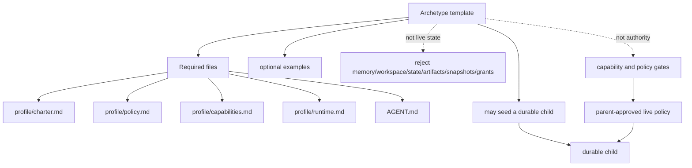
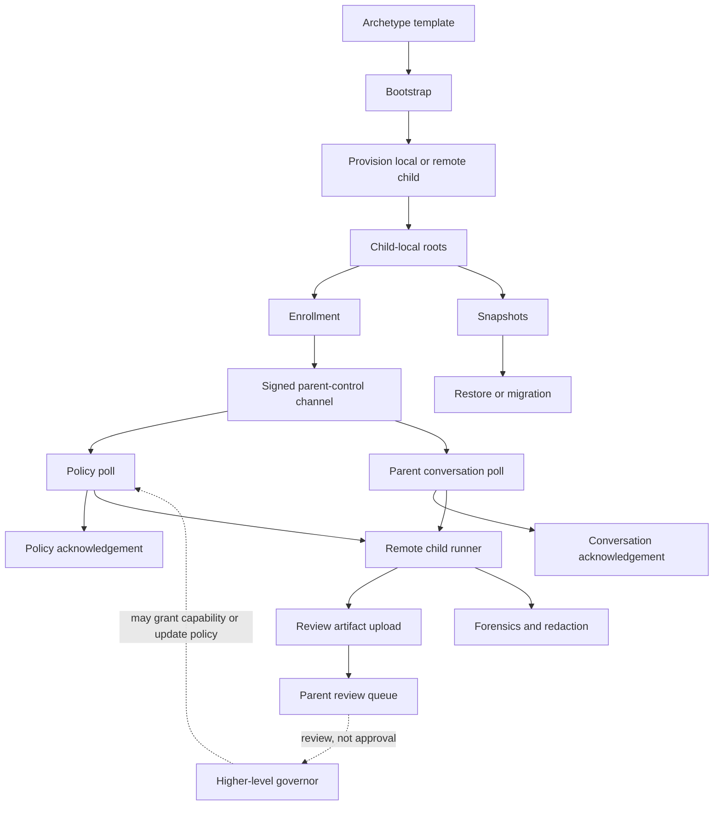
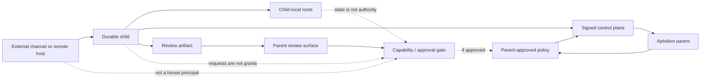

# durableagent

`durableagent/` is Aphelion's durable child-agent substrate.

It is not the child persona, not a plugin layer, and not a permission system. It
is the package that lets child agents persist, wake, sync, report, recover, and
carry local continuity without silently inheriting the parent house's identity,
memory, credentials, or authority.

The product question for this package is:

> How can a child agent continue over time without becoming an unbounded little
> ghost in the machine?

The package answer is: make continuation material, inspectable, and bounded.

## Telos

`durableagent/` exists for governed continuation.

A durable child may have local roots, a runtime, snapshots, an enrollment
identity, a signed parent-control channel, policy evidence, conversation relay,
and review artifacts. None of those facts are authority by themselves.

The invariant is:

> `durableagent/` may move, validate, contain, and record child-agent data; it
> may not grant authority or change parent policy by itself.

That means:

- persistence is not permission;
- waking is not authority;
- enrollment is not a grant;
- channel access is not parenthood;
- review artifacts are not approval;
- recovery must be grounded in artifacts, not chat-memory theater.

Higher layers still decide live policy, capability grants, memory promotion,
operator review, deployment, public contact, and parent-visible identity.

## The archetype

An archetype is the governed birth pattern for a durable child.

It is not the child itself. It is not live child state. It is not a capability
grant. It is the template shape that says: if this kind of child is going to
begin, what files and profile surfaces make it legible, bounded, recoverable,
and distinct enough to govern?

The required template files are:

- `AGENT.md`
- `profile/charter.md`
- `profile/policy.md`
- `profile/capabilities.md`
- `profile/runtime.md`

Optional examples may live under `examples/`. Live-state paths such as
`memory`, `workspace`, `state`, `artifacts`, `snapshots`, `grants`, and
`.aphelion` are rejected. An archetype can seed a child, but it must not smuggle
in the child's lived state.

The useful shorthand is:

> An archetype is a womb-form: enough structure to let a child begin, enough
> boundary to keep that beginning from becoming ungoverned.

## Main surfaces

`durableagent/` is easiest to read as a set of surfaces, not one monolith.

### Birth surface

Archetype loading, bootstrap serialization, provisioning plans, and local root
calculation define how a child begins and where its memory/workspace material
belongs.

Birth is a governance event, not just object construction.

### Identity surface

Enrollment, re-attestation, signatures, replay protection, and optional tailnet
peer binding let a child prove that parent-control messages are signed, fresh,
and attached to the expected child identity.

Continuity is allowed, but it must keep proving that it is legitimate.

### Control surface

The HTTP control plane accepts child-parent traffic through explicit routes,
byte limits, signed envelopes, sequence checks, and durable receipts.

A request does not count because it arrived. It counts only when it is signed,
fresh, scoped, and recognized.

### Policy surface

Policy polling and policy acknowledgement let a child fetch the current
parent-approved policy snapshot and report what it believes it received or
applied.

Policy acknowledgement is evidence of child state. It is not authority creation.

### Conversation surface

Parent conversation polling and acknowledgement let parent-authored messages
move down to a child without turning those messages into raw prompt mutation or
silent parent identity transfer.

The conversation is relayed, not fused.

### Review surface

Review artifact upload and queueing let a child report upward: results, asks,
risks, blocked questions, or evidence.

Upward flow is artifact-shaped, not raw transcript injection. Higher layers
decide whether an artifact becomes a capability request, policy update, memory
promotion, or ordinary reply.

### Forensic surface

Forensics and redaction preserve enough evidence to diagnose failures while
reducing the chance that child-originated reports leak secrets, credentials, or
private state into broader parent surfaces.

This is best-effort screening, not a full DLP claim.

### Remote runtime surface

The remote HTTP client, runtime sync, child runner, and loop runner let a remote
child breathe: enroll, poll policy, receive parent messages, execute within its
local charter, upload review artifacts, acknowledge delivery, and repeat.

The loop runner is scheduling plumbing, not autonomy ownership.

### Snapshot surface

Snapshots, restore, and migration preserve child continuity across operational
pressure. They are backups and repair tools, not activation authority.

Restore is mutating and belongs behind higher-level approval.

## Authority boundary

The most important thing to remember is what this package does **not** do.

`durableagent/` can contain child state, move signed child-parent protocol data,
record receipts, upload artifacts, and preserve snapshots. It cannot decide that
a child is allowed to contact the public, read an account, promote memory into
the parent, alter parent policy, merge code, restart services, or spend money.

Those are parent/governor/capability surfaces.

## Package map

A rough map of the current files:

- `archetype.go` — template loading and live-state rejection.
- `bootstrap.go` — initial remote runtime contract.
- `provision.go` — remote child install plans and payloads.
- `paths.go` — child-local workspace/memory root derivation.
- `signatures.go`, `http.go`, `controlplane.go` — signed envelopes and parent
  control-plane foundations.
- `http_*` files — enrollment, receipts, policy, parent conversation, tailnet
  binding, and client behavior.
- `remote_runtime.go`, `remote_child.go`, `remote_loop.go` — child-side sync,
  one-cycle execution, and repeated loop behavior.
- `forensics.go` — bounded child forensic/redaction support.
- `snapshot.go` — snapshot create/list/load/restore/migration.
- `runtime.go` — parent-side review artifact helper seams.

For the product-level inventory and maturity matrix, see
[`docs/architecture/durableagent-product-contract.md`](../docs/architecture/durableagent-product-contract.md).

## Newcomer read

If you are new to this package, start with this mental model:

> `durableagent/` makes child-agent continuation legible. It gives children a
> governed way to be born, identify themselves, receive policy, relay parent
> conversation, run bounded cycles, report upward, preserve snapshots, and
> recover. It deliberately does **not** give them authority by resemblance,
> persistence, channel presence, or desire.

When changing this package, preserve that separation. Make child continuation
more inspectable; do not make authority more implicit.
