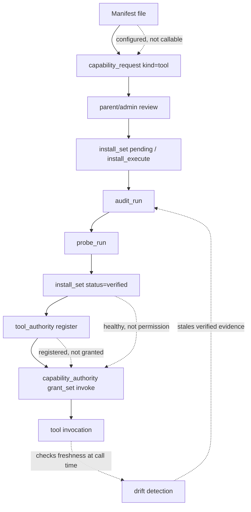
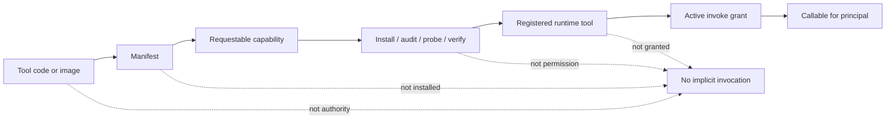

# external-tools

`external-tools/` is Aphelion's local exemplar surface for agent-owned external
tools.

It is not a plugin marketplace. It is not a bag of scripts that become callable
because they exist in the repository. It is the place where Aphelion demonstrates
how a tool can be described, installed, audited, probed, drift-checked,
registered, granted, and eventually invoked without putting domain behavior into
core.

The invariant is:

> Tool presence is not authority.

A manifest in this directory may make a tool visible as a requestable capability.
It does not make the tool installed, verified, registered, granted, callable, or
safe for a child to use.

## Why this folder exists

External tools are the tool-side analogue of durable children.

Durable children may persist and report, but persistence is not permission.
External tools may have code and manifests, but code presence is not permission.

Aphelion needs a way for agents and tenants to grow useful tool bodies without
teaching Aphelion core every domain-specific behavior. A browser, mailbox
adapter, public-site scout, vendor CLI, or local analyzer should be able to live
behind a manifest contract and lifecycle evidence, not as a hard-coded special
case inside `tool/` or `runtime/`.

That is the telos of this folder:

> materialize tools outside core while keeping authority, lifecycle evidence,
> sandbox constraints, and invocation grants inside governance.

## Candidate outpost senses

Aphelion can already improvise scripts during approved work. That means the
case for an external tool is not raw possibility. The case is ready sense: a
rehearsed, probed, bounded organ that a natural-language operator can rely on
from the outpost.

A script is a temporary prosthetic. A manifest-backed external tool is a
candidate body part: named, owned, installable, auditable, probeable,
drift-checkable, grant-gated, and explainable. These candidates are roadmap
entries, not implemented or callable tools. Each would need its own manifest,
lifecycle evidence, capability request, grant, and provider/network/credential
review where applicable.

Ranked by usefulness for the natural-language outpost:

1. **`observe_public_page` — sight.** Look at a public web page and report what
   is actually there: final URL, title, visible text summary, main content,
   links, forms/buttons, optional screenshot artifact, retrieval time,
   confidence, and failure reason. This is the direct successor to the bundled
   `browse_page` pilot. It needs explicit network policy and must not imply
   account/session/cookie use.
2. **`outpost_body_scan` — proprioception.** Sense Aphelion's own body from the
   operator's remote point of view: service state, recent journal errors,
   provider availability, quota/config blockers, sandbox readiness, grants,
   branch/deploy posture, and suggested next repair action. It should diagnose
   and summarize, not mutate service state.
3. **`repo_pr_status_digest` — repo hearing.** Listen to repository and PR
   state: branch head, PR checks, review state, mergeability signals, changed
   files, and next bounded action. It supports the inspect -> edit -> commit ->
   PR golden path, but should not merge, approve, or push unless a separate
   external-account grant permits that action.
4. **`site_change_detector` / `rss_feed_digest` — ambient hearing.** Notice
   public changes over time: docs releases, job pages, project feeds, vendor
   status, or other watched public sources. Output should be signal records
   with importance, why it matters, uncertainty, and recommended next action,
   not a firehose.
5. **`pdf_reading_sense` / `document_inspector` — document sight.** Inspect
   PDFs and structured documents as world objects: metadata, page count, text
   extraction, outline, tables/images if available, summary, citation anchors,
   and extraction confidence. It should keep source artifacts local and expose
   redaction/retention boundaries.
6. **`image_ocr_and_caption` / `screenshot_inspector` — visual perception.**
   Read screenshots, UI states, diagrams, and error images: OCR text, layout,
   visible controls, likely issue, and uncertainty. It should produce an
   evidence artifact rather than silently turning images into ungrounded prose.
7. **`child_judgment_record_lint` — governance sense.** Inspect a durable
   child's judgment record for category, confidence, action, why, uncertainty,
   policy version, source refs, retention, escalation, and redaction summary.
   It strengthens child-local operating membranes without teaching Aphelion core
   domain semantics.
8. **`memory_candidate_lint` / `mission_relevance_scan` — continuity sense.**
   Detect whether a conversation artifact is a durable memory candidate, a
   mission candidate, stale context, or something to ignore. It should propose
   review records, not write memory or missions by itself.
9. **`markdown_link_check` / `mermaid_validate` / `public_readiness_check` —
   practiced hands.** Rehearsed maintenance gestures for docs and release
   hygiene. These are less like new senses and more like reliable muscle memory:
   narrow, local, low-risk, and easy to probe.
10. **`elevenlabs_tts_artifact` — voice/expression.** Turn text into a local
    audio artifact using configured ElevenLabs surfaces. It should generate an
    artifact only, never send or publish it, and it requires explicit
    spend/privacy/credential/network review because text leaves the outpost.
11. **`codex_or_openai_image_generation` — imagination/artifact creation.**
    Generate a local image artifact through an already-governed image lane.
    This is powerful, but less foundational than sight, hearing, and
    proprioception. It should return local artifacts and exact blockers, not
    fall back across providers or APIs without a separate grant.

The product test for any new external tool is:

> Does this make the outpost's body more reliable for a natural-language
> operator, while keeping materialization, health, authority, and invocation as
> separate facts?

## Current pilot

The bundled pilot is `browse_page`:

```text
external-tools/
└── browse_page/
    ├── manifest.json
    └── bin/
        ├── browse_page.sh
        ├── install.sh
        └── probe.sh
```

It is intentionally a deterministic fixture. `browse_page.sh` accepts a JSON
payload with a `url` field and returns deterministic JSON with `url`, `title`,
and `summary`. It does not fetch the network. Its purpose is to exercise the
manifest and lifecycle lane without adding browser dependencies or page-fetching
logic to Aphelion core.

The manifest currently declares:

- `name`: `browse_page`
- `owner`: `child-alpha`
- `version`: `pilot-fixture-v1`
- `execution.mode`: `process`
- `execution.entry`: `./external-tools/browse_page/bin/browse_page.sh`
- input/output JSON schemas
- `constraints.network`: `none`
- runtime ceilings
- install/probe commands
- provenance request id

A real browser-backed implementation should replace the external
script/container behind the same manifest contract. It should not turn browser
behavior into a core runtime special case.

## Manifest contract

A manifest is the core-readable tool contract. It says what the tool is, who owns
it, how it is executed, what JSON it accepts and returns, what constraints apply,
and how lifecycle checks should prove the current artifact.

The current manifest shape is defined in `tool/external_manifest.go` and includes
these main surfaces:

- `name` and `owner` — identity and stewardship.
- `version` — human-readable manifest/tool version.
- `execution` — mode, entry, workdir, and timeout.
- `io` — input and output JSON schemas.
- `constraints` — network, filesystem, memory, and runtime ceilings.
- `container` — image/digest/build identity for container-mode tools.
- `install` — optional install command.
- `audit` — optional declared import/loadability audit command.
- `probe` — behavioral probe command and expected output.
- `rollback` and `uninstall` — optional retirement commands.
- `provenance` — request/registration metadata.

The manifest is necessary evidence, not sufficient authority.

## Lifecycle

The canonical lifecycle is:

1. `capability_request` with `kind=tool`
2. install record and install execution or operator-owned equivalent
3. `audit_run`
4. `probe_run`
5. `install_set status=verified`
6. register
7. grant
8. invoke

Each phase answers a different question:

- **Request**: who wants this tool, and under what proposed contract?
- **Install**: what artifact/path/image/package set is being claimed?
- **Audit**: can the runtime resolve/load the declared entry for this baseline?
- **Probe**: does the declared behavior work for this baseline?
- **Verify**: do install, audit, probe, manifest, and workspace anchors still
  match?
- **Register**: is this implementation exposed as a named runtime tool?
- **Grant**: which principal may invoke it?
- **Invoke**: is the current caller allowed, and is the verified baseline still
  fresh?



## Authority boundary

There are three separate questions that should never be collapsed:

1. **Is the tool described?** The manifest exists and validates.
2. **Is the tool healthy?** Install/audit/probe/verify evidence is fresh.
3. **May this principal invoke it?** Registration and active capability grant
   allow invocation, and freshness checks still pass.

A described tool is not a healthy tool. A healthy tool is not an authorized tool.
An authorized tool can still become stale before invocation.



## Sandbox and constraints

For `process` and `subprocess` tools, Aphelion executes through the sandbox
runner when the declared constraints are supported.

Current practical expectations:

- process/subprocess tools must speak JSON on stdin/stdout;
- input and output are checked against manifest schemas when declared;
- execution timeout is capped by the manifest/runtime ceiling;
- network defaults to no ambient permission;
- `network="allowlist"` requires an isolated sandbox profile with matching
  allowlist ceilings;
- unsupported execution modes remain visible as non-executable manifest entries,
  not falsely callable tools.

Container and workspace-runner modes have separate semantics. They may be
importable or diagnosable before they are invokable by the default process
executor.

## Drift and freshness

Verification is tied to anchors, not vibes.

Current drift anchors include:

- `install_ref` — the operator-owned install artifact, image, path, or package
  reference;
- manifest hash — the normalized functional manifest contract;
- workspace fingerprint — local command/entry files for process tools, or
  container image/build/health identity for container tools.

If those anchors move, the verified claim must go stale. A stale tool should not
be registered as callable or invoked until it is re-audited, re-probed, and
re-verified.

This is why `verified` should mean fresh current evidence: install + audit +
probe are green for the current baseline.

## How to read this folder

Use this folder as an example of the product contract, not as a grant of power.

When adding a new external tool, keep these questions explicit:

- Who owns the tool?
- What domain behavior stays outside Aphelion core?
- What JSON input/output contract does the tool expose?
- What install/audit/probe evidence proves the current artifact?
- What sandbox/network/filesystem ceilings does it need?
- What drift anchors should stale the tool?
- Which principal, if any, may invoke it after registration and grant?
- What must never be inferred merely from the tool's presence?

## Newcomer read

If you are new to this folder, read it this way:

> `external-tools/` is where Aphelion shows how external capabilities become
> material without becoming automatically authorized. A tool can be present,
> described, installed, audited, probed, verified, registered, and granted. Each
> step says one bounded thing. Only the final, current, principal-specific grant
> plus freshness check makes invocation possible.

When changing this folder, preserve that separation. Make tool materialization
more inspectable; do not make authority more implicit.
